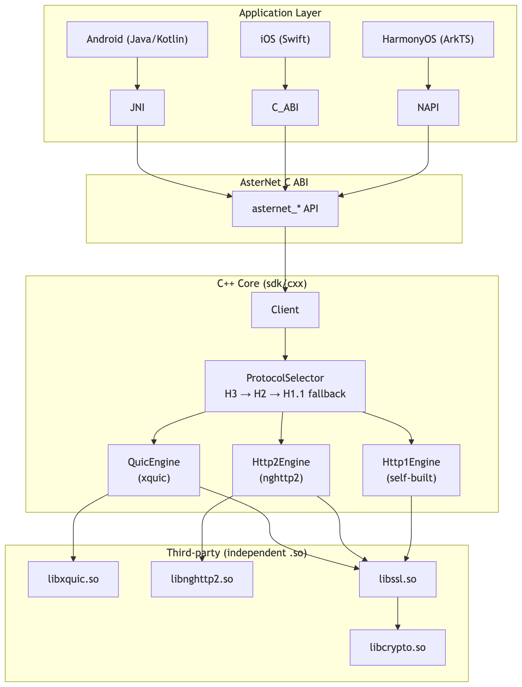
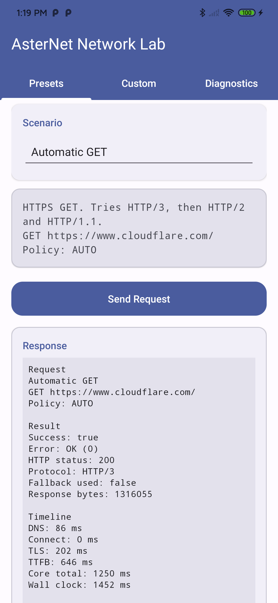
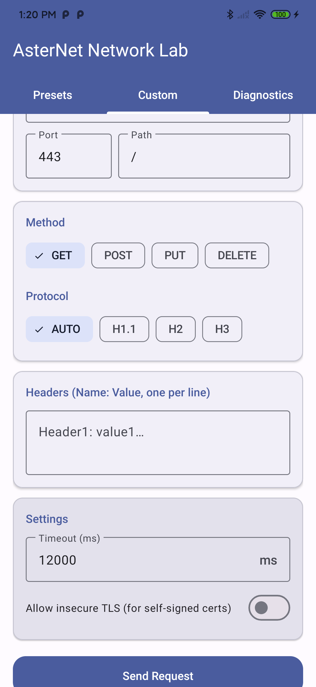
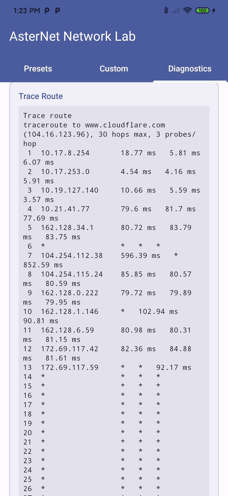
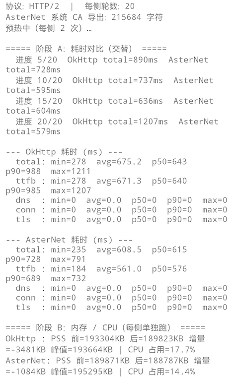

# AsterNet

**跨平台 C++ 网络核心，同时支持 HTTP/1.1、HTTP/2 与基于 QUIC 的 HTTP/3。**

面向需要直接控制协议、追求多平台一致性、且希望摆脱平台 HTTP 栈束缚的移动 SDK 团队。

[English](README.md)

## 为什么选择 AsterNet

平台自带的 HTTP 客户端（OkHttp、URLSession、`@ohos.net.http`）都是黑盒——你无法查看协议协商过程、无法测量分阶段时延、也无法自定义 TLS 行为。AsterNet 把完整控制权交给你：DNS → TCP/QUIC → TLS → HTTP 帧，每一个字节都清晰可见。

| | OkHttp | Cronet | AsterNet |
|---|--------|--------|----------|
| **跨平台** | 仅 Android/JVM | Android（Chromium） | Android、iOS、HarmonyOS、Linux/macOS |
| **协议控制** | 受限（ALPN 提示） | 受限 | 逐请求可选：AUTO / H1 / H2 / H3 |
| **HTTP/3** | 实验性 | ✅ | ✅（XQUIC） |
| **分阶段指标** | ❌ | 受限 | ✅ DNS、Connect、TLS、TTFB、Total |
| **TLS 定制** | 仅 HostnameVerifier | ❌ | ✅ 自定义 CA 证书包、证书校验回调 |
| **二进制体积** | ~1 MB（JVM） | ~8 MB（native） | ~3 MB（native，不含 H3） |
| **并发模型** | 线程池 | 线程池 | 同步 API，由调用方掌控线程 |
| **内存** | GC 管理 | 原生堆 | 原生堆，无 GC 压力 |

## 架构




## 核心能力

### 协议栈
- **HTTP/1.1** — 自研引擎，支持 chunked 编码、keep-alive
- **HTTP/2** — 完整集成 nghttp2，支持多路复用、HPACK、服务端推送（server push）
- **HTTP/3** — 基于 alibaba/xquic 的 QUIC，支持 0-RTT、连接迁移

### 协议选择
- **AUTO** — H3 → H2 → H1.1 自动降级，带熔断机制
- **逐请求控制** — 可强制指定任意协议，跳过自动降级
- **主机级熔断** — 单主机连续 3 次失败即进入 60 秒冷却

### 智能 DNS 解析（Smart DNS Resolution）
- **HTTPDNS → LocalDNS → 备用 IP** 三级容灾链
- **基于健康度的 IP 评分** — 综合 RTT / 丢包 / 失败惩罚，稳定排序（最优 IP 在前）
- **TTL 缓存**，支持 stale-while-revalidate + LRU 淘汰，以 `network_epoch` 为键
- IP 字面量快速通道 + `prefetch` 预热

### 弱网检测与优化（Weak Network Detection & Optimization）
- **质量评分** — 综合 RTT / 丢包 / 带宽加权，状态机 `UNKNOWN → HEALTHY → DEGRADED → BAD`
- **EMA 平滑 RTT** + 通过 QUIC 连接统计被动观测（零探测开销）
- **自适应策略** — 超时 / 并发 / 重试随实时网络质量动态调整

### 连接池（Connection Pool）
- **租约模型** — `acquire → use → release`，生命周期显式化
- **LRU 淘汰** + 网络切换时全量清理

### 请求编排（Request Orchestration）
- **拦截器链** — 弱网防护 + 重试
- **重试** — 指数退避 + 抖动，共享 deadline，幂等性自动识别
- **请求合并去重** — GET/HEAD 去重，auth/proxy/CA 隔离，请求头白名单

### 安全（Security）
- 基于 BoringSSL（与 Chromium 同引擎）的 TLS 1.3
- 自定义 CA 证书包注入
- 证书校验回调（信任前可检查证书链）
- DNS SSRF 防护 — 私有/特殊 IP 过滤（IPv4 + 6 种 IPv6 嵌入 IPv4 格式）
- 本地开发可用 `allow_insecure_tls_for_testing`

### 可观测性（Observability）
- 分阶段时延：DNS、Connect、TLS、TTFB、Total（核心时钟 + 墙钟）
- 实际使用的协议（即使发生降级）+ 降级标记
- 原生日志回调 → 可对接任意日志系统
- 诊断快照（连接池、DNS 缓存、质量快照）

### 网络诊断（Network Diagnostics）
- **Trace route** — 逐跳 TTL + 每探测 RTT，超时显示为 `*`（无需 root）
- **网络切换通知** — 切换时重置质量探测与连接池

### 平台支持
| 平台 | 状态 | SDK 形态 |
|----------|--------|------------|
| Android | ✅ 生产可用 | AAR + .so（arm64-v8a，16KB 页） |
| iOS | 🚧 示例就绪 | xcframework（待发布） |
| HarmonyOS | 🚧 示例就绪 | .har（待发布） |
| Linux/macOS | ✅ C++ 测试 | 静态/动态库 |

## 快速开始

### Android

```bash
# 1. 准备三方依赖（一条命令）
./sdk/third_party/repack.sh

# 2. 构建 APK
./gradlew :examples:android:assembleDebug

# 3. 安装
adb install -r examples/android/build/outputs/apk/debug/android-debug.apk
```

Demo 有三个标签页：

| 标签页 | 展示内容 |
|-----|---------------|
| **Presets** | 一键场景（`Automatic GET`、`HTTP/1.1/2/3 GET`、`HTTP/2 POST`），含完整分阶段时间线 |
| **Custom** | 自由构造任意请求——方法、协议、请求头、超时、不安全 TLS |
| **Diagnostics** | 实时网络状态、质量快照、trace route、诊断快照 |

<p align="left">
  
  
  
</p>

### C++（桌面端）

```bash
cmake -S . -B build -DCMAKE_BUILD_TYPE=Debug
cmake --build build -j
ctest --test-dir build --output-on-failure
```

## API

### C ABI（所有平台）

```c
#include "asternet/asternet.h"

// 创建客户端
asternet_client_config_t cfg = { .struct_size = sizeof(cfg),
    .abi_version = ASTERNET_ABI_VERSION,
    .default_timeout_ms = 12000,
    .enable_http3 = 1 };
asternet_client_t *client = asternet_client_create(&cfg, NULL);

// 同步请求
asternet_request_t req = { .host = "www.cloudflare.com", .port = 443,
    .method = "GET", .path = "/",
    .protocol_policy = ASTERNET_POLICY_AUTO,
    .timeout_ms = 12000 };
uint8_t body[1024 * 1024];
asternet_response_info_t info;
asternet_client_request_sync(client, &req, body, sizeof(body), &info);

printf("HTTP %d via %s, %zu bytes, %lld ms\n",
    info.http_status,
    info.protocol == ASTERNET_PROTOCOL_HTTP_3 ? "H3" : "H2/H1",
    info.body_size, info.total_ms);

asternet_client_destroy(client);
```

### Android（Java/Kotlin）

```java
AsterNet.Client client = AsterNet.createClient(true, caBundlePem);
AsterNet.Response resp = client.request(
    "www.cloudflare.com", 443, "GET", "/",
    AsterNet.Policy.AUTO, "", new byte[0], 12000, true);
System.out.println(resp.protocolName() + " " + resp.status);
client.close();
```

完整细节见 [API Reference](docs/API.md)。

## 性能

| 指标 | 数值 | 说明 |
|--------|-------|-------|
| HTTP/1.1 TTFB | ~50–200 ms | 取决于网络 RTT |
| HTTP/2 TTFB | ~40–150 ms | 多路复用、单连接 |
| HTTP/3（QUIC）TTFB | ~10–30 ms | 重连时可能 0-RTT |
| H3 连接建立 | ~1 次握手 | 对比 H2：TCP + TLS（2–3 次往返） |
| 二进制体积（全部 .so） | ~7.5 MB | 6 个独立 .so 文件 |
| 每请求内存 | ~1 MB | 缓冲区大小可配置 |
| 并发请求数 | 无上限 | 由调用方控制线程池 |

## 并发与稳定性

- **同步 API** — 无隐藏线程池、无回调地狱，由调用方选择线程模型。
- **线程安全** — 单个 client 实例可跨线程共享（每请求一把互斥锁）。
- **熔断器** — 按主机、按协议。3 次失败 → 60 秒冷却，防止级联故障。
- **无 GC 压力** — C++ 核心，请求期间 JVM 堆零分配。
- **确定性的资源生命周期** — `create` → `request` → `destroy`，无连接泄漏。

## 与 OkHttp 对比

详细分析见 [docs/OKHTTP_COMPARISON.md](docs/OKHTTP_COMPARISON.md)。

**实测对比**（真实业务接口，HTTP/2，20 轮，Android 真机）：

| 指标 | AsterNet 相对 OkHttp |
|--------|-------|
| 平均耗时 | 降低约 10% |
| CPU 占用 | 降低约 19% |

<p align="left">
  
</p>

**关键差异：**

1. **协议可见性** — OkHttp 把协议选择隐藏在拦截器之后；AsterNet 逐请求暴露 `protocol_policy`，并上报实际使用的协议。

2. **时延分解** — OkHttp 的 `EventListener` 提供基于回调的计时；AsterNet 在每个响应结构体里直接返回 `{dns_ms, connect_ms, tls_ms, ttfb_ms, total_ms}`。

3. **HTTP/3** — OkHttp 的 H3 是实验性的，且仅限特定 JVM 构建；AsterNet 的 H3 是经 xquic 的原生 QUIC，已在阿里云 CDN 生产环境使用。

4. **跨平台** — OkHttp 仅限 JVM；AsterNet 通过同一套 C ABI 运行在 iOS、HarmonyOS 与桌面端。

5. **二进制开销** — OkHttp 需要 JVM + Kotlin 标准库（~2 MB）；AsterNet 是纯原生代码（~3 MB .so）。

## 目录结构

```text
sdk/                    SDK（交付物）
├── cxx/                C++ 核心 → libasternet.so
│   └── public/         公共 C ABI 头文件
├── android/            Android JNI 桥接 + AAR
├── ios/                iOS Framework（占位）
├── harmonyos/          HarmonyOS NAPI 桥接（占位）
└── third_party/        三方库：nghttp2、xquic、BoringSSL → 独立 .so

examples/               可运行示例
├── android/            Android Demo（Presets + Custom + Diagnostics 三个标签页）
├── cxx/                C++ 单元测试
├── ios/                iOS Demo（SwiftUI）
├── harmonyos/          HarmonyOS Demo（ArkTS）
└── server/             Go 测试服务器（H1/H2/H3）

scripts/                构建与发布脚本
docs/                   文档
```

## License

Apache License 2.0。第三方依赖保留其原有许可证。
