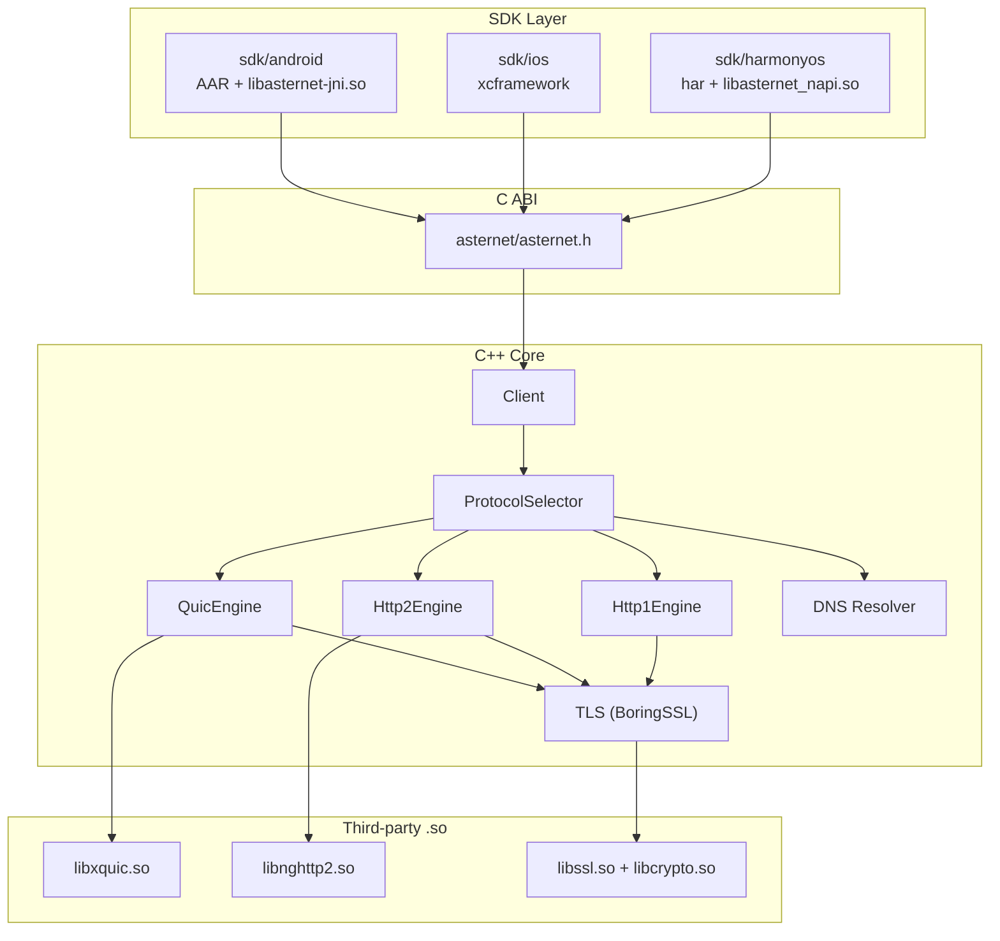
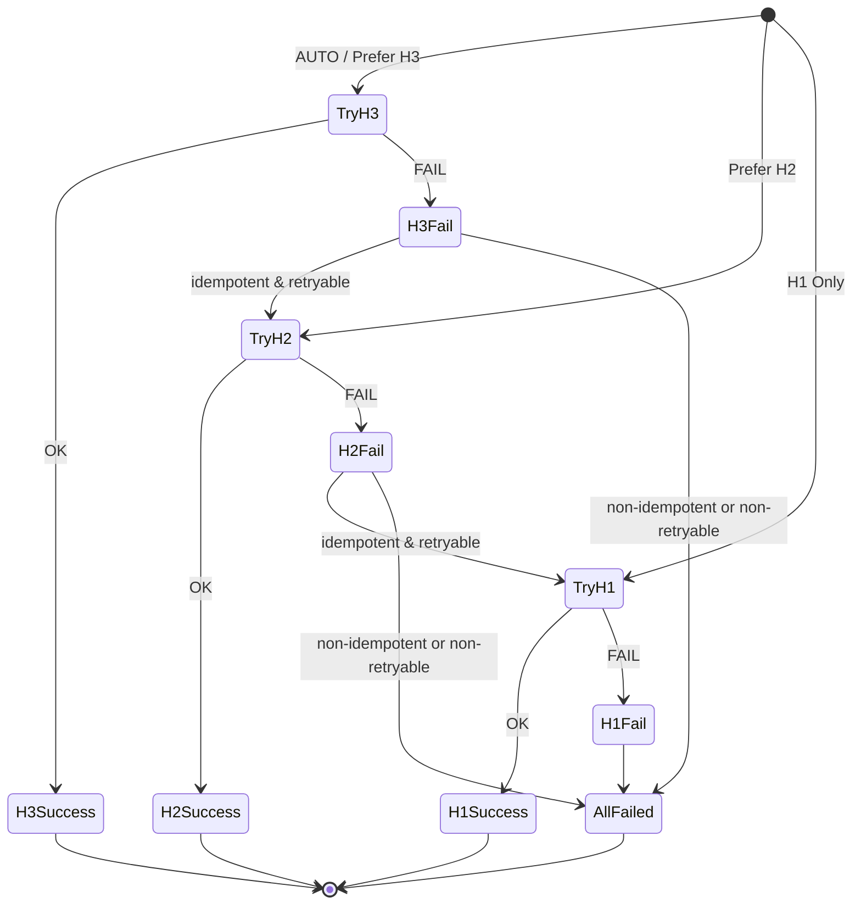
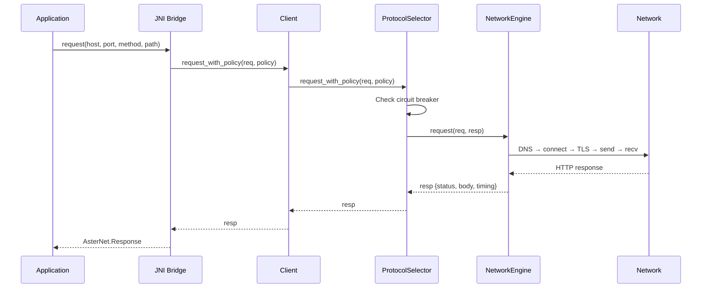
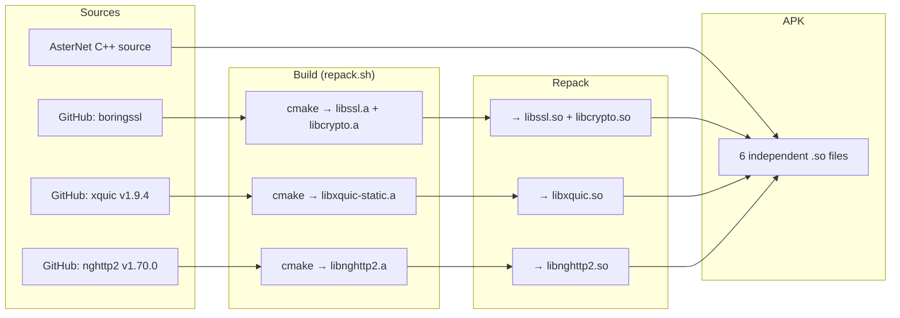

# AsterNet Architecture

## System Overview



## Component Design

### ProtocolSelector — Fallback Chain

The core routing decision engine. Implements a priority-ordered fallback chain with per-host circuit breaking.



**Circuit breaker rules:**
- 3 consecutive failures for a protocol on a specific host → 60s ban
- Non-idempotent requests (POST, PATCH) → no automatic fallback
- Timeout consumed by failed attempts is deducted from remaining budget

### Engine Interface

```cpp
class NetworkEngine {
public:
    virtual int request(const Request &req, Response &resp) = 0;
    virtual EngineType type() const = 0;
    virtual EngineCaps caps() const = 0;
};
```

### Independent .so Architecture

```
APK lib/arm64-v8a/
├── libcrypto.so       (BoringSSL, 2.1 MB)
├── libssl.so          (BoringSSL, 551 KB)
├── libnghttp2.so      (HTTP/2, 240 KB)
├── libxquic.so        (QUIC/H3, 611 KB)
├── libasternet-jni.so (AsterNet JNI, 3.0 MB)
└── libc++_shared.so   (NDK runtime, 1.3 MB)
```

## Data Flow



## Security Architecture

### TLS Chain

```
Application
  └─ AndroidCAStore (Java) → PEM bundle (139 system certs)
      └─ asternet_client_config_t.ca_cert_pem
          └─ BoringSSL SSL_CTX → X509_STORE
              └─ SSL_connect → verify server cert chain
```

## Build Pipeline



## Directory Layout

```text
AsterNet/
├── sdk/                        # Deliverable SDK components
│   ├── cxx/                    # C++ core library
│   │   ├── public/asternet/    #   Public C ABI headers
│   │   ├── client.{h,cpp}      #   Client facade
│   │   ├── abi/abi.cpp         #   C ABI implementation
│   │   ├── engine/             #   HTTP engines (h1, h2, quic)
│   │   └── platform/           #   OS abstractions
│   ├── android/                # Android JNI + AAR
│   ├── ios/                    # iOS (C ABI + Swift wrapper)
│   ├── harmonyos/              # HarmonyOS (NAPI + ArkTS)
│   └── third_party/            # Third-party build orchestration
├── examples/                   # Runnable examples (per-platform)
├── docs/                       # Documentation
└── scripts/                    # Build & release scripts
```
